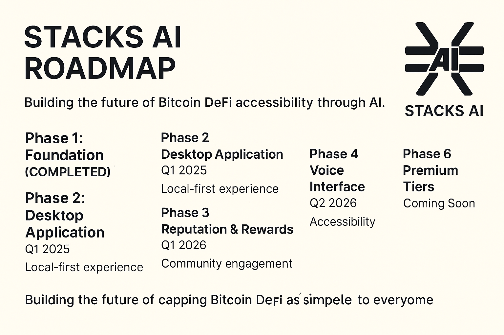
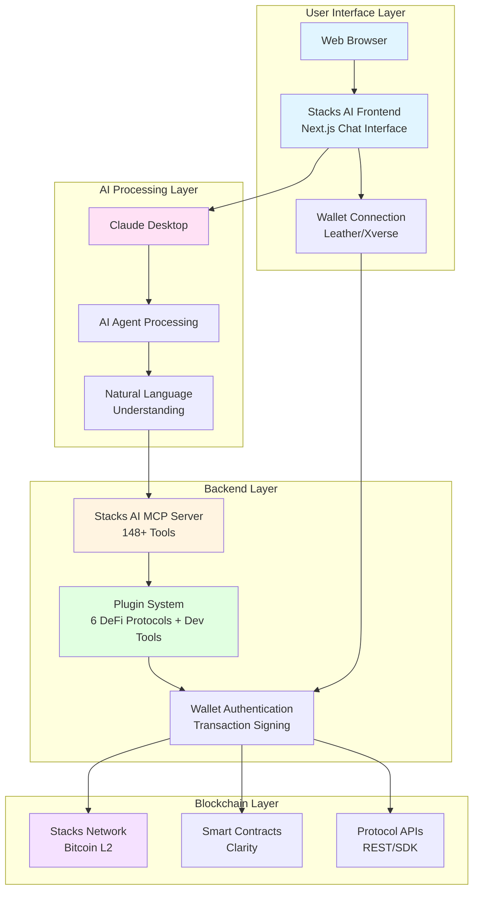
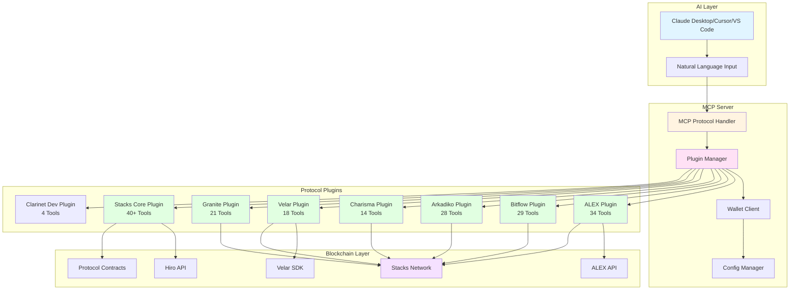
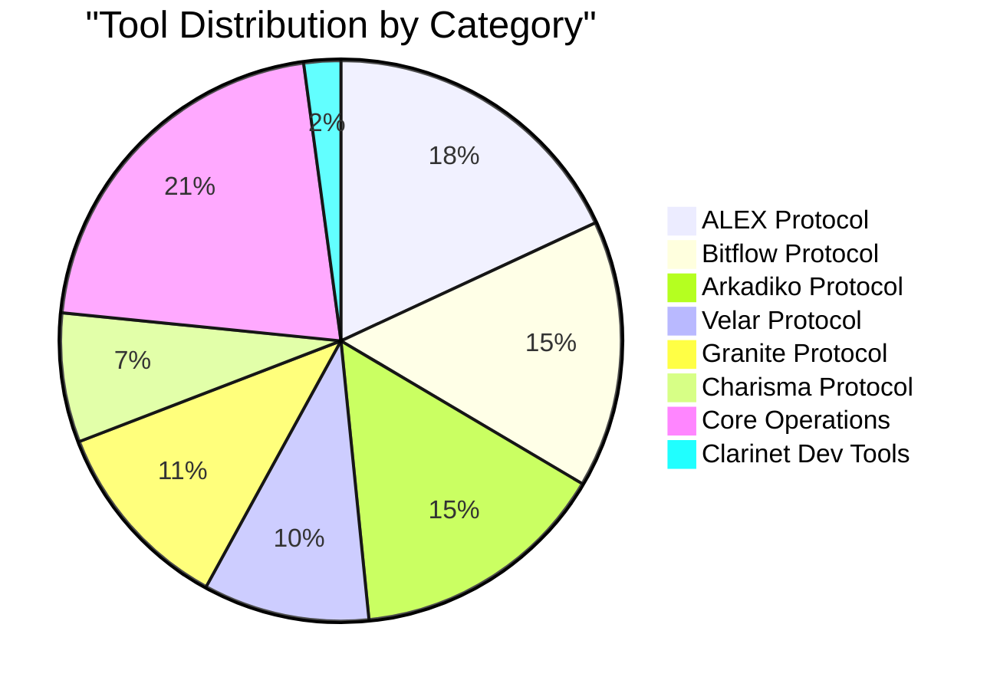

# Stacks AI ~ MCP Server


## Roadmap



Comprehensive Model Context Protocol (MCP) server for the Stacks Bitcoin Layer 2 DeFi ecosystem. Part of the **Stacks AI** project, providing unified access to 6 major DeFi protocols with over 148+ professional tools for lending, trading, staking, governance operations, and Clarity smart contract development.

[](stacks-mcp-server/README.md#supported-protocols)
[](stacks-mcp-server/README.md#tool-categories)
[](stacks-mcp-server/README.md#network-endpoints)
[](stacks-mcp-server/README.md#mcp-protocol-compliance)

---

## Table of Contents

- [Overview](#overview)
  - [Stacks AI Ecosystem](#stacks-ai-ecosystem)
  - [Architecture Overview](#architecture-overview)
- [Supported Protocols](#supported-protocols)
- [Quick Start](#quick-start)
  - [Prerequisites](#prerequisites)
  - [Installation](#installation)
  - [Environment Configuration](#environment-configuration)
- [Usage Examples](#usage-examples)
- [Architecture](#architecture)
  - [Plugin System](#plugin-based-system)
  - [Core Components](#core-components)
  - [Transaction Flow](#transaction-flow)
- [API Integration](#api-integration)
- [Development](#development)
- [Testing](#testing)
- [Security Considerations](#security-considerations)
- [MCP Protocol Compliance](#mcp-protocol-compliance)
- [Troubleshooting](#troubleshooting)
- [Project Statistics](#project-statistics)

---

## Overview

Stacks AI MCP Server enables AI agents and applications to interact with the entire Stacks DeFi ecosystem through a standardized protocol interface. It integrates with all major Bitcoin DeFi protocols on Stacks, enabling natural language interactions with Bitcoin DeFi.

### Stacks AI Ecosystem

The Stacks AI project consists of two main components:

1. **MCP Server** (this repository) - Backend protocol integration exposing Bitcoin DeFi operations
2. **Frontend** (separate repository) - Chat-based user interface with Stacks wallet integration



### Architecture Overview




## Supported Protocols

### Protocol Integration Map


### ALEX Protocol
Automated Market Maker (AMM) and DEX with multi-hop routing capabilities.

**Features:**
- Multi-hop token swaps (1-4 pool routing)
- Liquidity pool operations
- Price feeds and market statistics
- TVL and volume analytics
- Flash loan integration
- 34 tools covering all AMM operations

### Bitflow Protocol
Stable-focused DEX with keeper-based automation system.

**Features:**
- StableSwap and XYK pools
- Keeper-based automated execution
- BTC to sBTC bridge operations
- DCA (Dollar Cost Averaging) orders
- Group order management
- 29 tools for stable swaps and automation

### Arkadiko Protocol ⚠️ Mainnet Only
Multi-collateral lending platform with stablecoin minting.

**Features:**
- Collateralized debt positions (CDPs)
- USDA stablecoin minting
- Vault management and liquidations
- DEX operations and liquidity provision
- Governance proposals and voting
- DIKO token staking
- 28 tools for comprehensive DeFi operations

**Network Availability:**
- ✅ **Mainnet**: Fully functional at `SP2C2YFP12AJZB4MABJBAJ55XECVS7E4PMMZ89YZR`
- ❌ **Testnet**: Not deployed on public testnet
- ⚙️ **Local Development**: Deploy to mocknet using Arkadiko's development setup

**Note**: Arkadiko operations will return an error when `STACKS_NETWORK=testnet`. For testing, either use mainnet with small amounts or deploy Arkadiko contracts to a local mocknet environment.

### Charisma Protocol
Vault-based DEX with Blaze intent execution protocol.

**Features:**
- Composable vault routing
- Limit and triggered orders
- Blaze intent protocol execution
- Multihop swap routing
- API key management for automation
- 14 tools for advanced trading strategies

### Velar Protocol
Multi-chain Bitcoin Layer-2 DEX.

**Features:**
- SDK-based swap routing
- Token pair management
- Price feeds and historical data
- Pool analytics and liquidity tracking
- Cross-chain token support
- 18 tools combining SDK and API operations

### Granite Protocol
Bitcoin-native lending protocol with sBTC collateral.

**Features:**
- BTC-backed stablecoin borrowing
- Liquidity provision with yield
- LP token staking for rewards
- Liquidation operations
- Flash loans for advanced strategies
- Governance proposals
- 21 tools for complete lending operations

### Clarinet Development Tools
Smart contract development toolkit for Clarity developers.

**Features:**
- Complete Clarinet project generation
- SIP-009 NFT contract templates
- SIP-010 Fungible Token contract templates
- Comprehensive test suite generation
- Network configuration for mainnet/testnet/devnet
- 4 tools for contract development workflow

## Quick Start

### Prerequisites

- Claude Desktop application (or Cursor/VS Code with MCP support)
- Node.js 18 or higher
- pnpm package manager
- Stacks wallet (private key or mnemonic)

### Installation

1. **Clone and build the server**
   ```bash
   git clone https://github.com/Stack-AI-MCP/stacks-mcp-server
   cd stacks-mcp-server
   pnpm install
   pnpm build
   ```

2. **Configure environment variables**
   ```bash
   cp .env.example .env
   ```
   Edit `.env` file with your wallet credentials and network preferences.

3. **Automated Setup (Recommended)**

   Use the automated setup script to configure your preferred AI application:

   ```bash
   # Interactive mode - choose which application to configure
   pnpm setup

   # Configure Claude Desktop only
   pnpm setup:claude

   # Configure Cursor editor only
   pnpm setup:cursor

   # Configure VS Code only
   pnpm setup:code

   # Configure multiple applications
   ./setup-mcp.sh --claude --cursor --code
   ```

   The setup script will:
   - Read your `.env` configuration
   - Generate the appropriate MCP configuration
   - Install it in the correct location for your chosen application(s)
   - Provide restart instructions

4. **Manual Configuration (Alternative)**

   If you prefer manual setup, you can configure the applications directly:

   **Claude Desktop**: `~/Library/Application Support/Claude/claude_desktop_config.json`
   **Cursor Editor**: `~/.cursor/mcp.json` (global) or `.cursor/mcp.json` (project-specific)
   **VS Code**: `~/Library/Application Support/Code/User/mcp.json` (global) or `.vscode/mcp.json` (project-specific)

   The configuration format should look like:
   ```json
   {
     "mcpServers": {
       "stacks-mcp": {
         "command": "node",
         "args": ["/absolute/path/to/stacks-mcp-server/dist/index.js"],
         "env": {
           "WALLET_PRIVATE_KEY": "0x1234567890abcdef1234567890abcdef1234567890abcdef1234567890abcdef",
           "STACKS_NETWORK": "testnet",
           "STACKS_MAINNET_API_URL": "https://api.hiro.so",
           "STACKS_TESTNET_API_URL": "https://api.testnet.hiro.so",
           "BITFLOW_API_HOST": "https://api.bitflow.finance",
           "BITFLOW_API_KEY": "placeholder_key_request_from_bitflow_team",
           "BITFLOW_PROVIDER_ADDRESS": "placeholder_address",
           "READONLY_CALL_API_HOST": "https://api.bitflow.finance",
           "READONLY_CALL_API_KEY": "placeholder_key",
           "KEEPER_API_HOST": "https://keeper.bitflow.finance",
           "KEEPER_API_KEY": "placeholder_key"
         }
       }
     }
   }
   ```

   **Note:** For BitFlow protocol features to work, you must obtain API keys from the BitFlow team. Contact them through their official documentation for API access.

5. **Restart your AI application**

   Close and reopen Claude Desktop, Cursor, or VS Code to load the MCP server.

### Environment Configuration

| Variable | Required | Description |
|----------|----------|-------------|
| `WALLET_PRIVATE_KEY` | Either | Stacks wallet private key (64 hex chars, with or without 0x) |
| `WALLET_MNEMONIC` | Either | Stacks wallet mnemonic phrase (12 or 24 words) |
| `STACKS_NETWORK` | Yes | Network selection: `mainnet`, `testnet`, or `devnet` |
| `STACKS_MAINNET_API_URL` | No | Custom mainnet API endpoint (default: Hiro API) |
| `STACKS_TESTNET_API_URL` | No | Custom testnet API endpoint (default: Hiro API) |
| `HIRO_API_KEY` | No | Hiro API key for higher rate limits |
| `BITFLOW_API_HOST` | No | BitFlow API host (default: https://api.bitflow.finance) |
| `BITFLOW_API_KEY` | No | BitFlow protocol API key (contact BitFlow team) |
| `BITFLOW_PROVIDER_ADDRESS` | No | BitFlow provider address |
| `READONLY_CALL_API_HOST` | No | BitFlow readonly call API host |
| `READONLY_CALL_API_KEY` | No | BitFlow readonly API key |
| `KEEPER_API_HOST` | No | BitFlow keeper API host |
| `KEEPER_API_KEY` | No | BitFlow keeper API key |

### Network Endpoints

- **Testnet**: `https://api.testnet.hiro.so` (development use)
- **Mainnet**: `https://api.hiro.so` (production use with real Bitcoin)
- **Devnet**: `http://localhost:20443` (local development with Clarinet)

## Usage Examples

### Token Operations
```
"Transfer 100 STX to ST1PQHQKV0RJXZFY1DGX8MNSNYVE3VGZJSRTPGZGM"
"Check my STX balance"
"Send 50 ALEX tokens to alice.btc"
"What's my USDA balance?"
```

### Smart Contracts
```
"Deploy a new Clarity contract from /path/to/contract.clar"
"Call the transfer function on contract SP2C2YFP12AJZB4MABJBAJ55XECVS7E4PMMZ89YZR.arkadiko-token"
"Get contract info for ALEX token"
"Read the get-balance function for my address"
```

### Stacking (PoX) Operations
```
"Stack 1000 STX for 6 cycles"
"Check my current stacking status"
"What's the minimum STX to stack?"
"Show me the current PoX cycle information"
"Delegate 500 STX to pool SP000..."
```

### ALEX DEX Trading
```
"Swap 100 STX for ALEX on ALEX DEX"
"Get the best price for 1000 ALEX to USDA"
"What's the current STX/ALEX exchange rate?"
"Add liquidity to the STX-ALEX pool"
"Check my liquidity positions on ALEX"
```

### Arkadiko Protocol (Mainnet Only)
```
"Open a vault with 1000 STX collateral"  # Requires mainnet
"Mint 500 USDA from my vault"  # Requires mainnet
"Check my vault health and liquidation price"  # Requires mainnet
"Repay 100 USDA to my vault"  # Requires mainnet
"Close vault #123 and withdraw collateral"  # Requires mainnet
```

**Note**: Set `STACKS_NETWORK=mainnet` in your `.env` to use Arkadiko tools. Testnet operations are not supported for this protocol.

### Charisma Protocol
```
"Create a new composable vault for STX-ALEX yield"
"Deposit 1000 STX into vault #456"
"Check my vault balance and APY"
"Execute Blaze intent: swap STX for best stablecoin"
```

### Velar Protocol
```
"Swap 500 STX for USDA on Velar"
"Add liquidity to STX-USDA pool on Velar"
"Check Velar pool statistics for STX pairs"
"What's the TVL on Velar protocol?"
```

### Granite Lending
```
"Supply 0.1 sBTC to Granite lending pool"
"Borrow USDA against my sBTC collateral"
"Check my borrowing capacity on Granite"
"Repay my USDA loan on Granite"
```

### NFT Operations
```
"Mint an NFT with metadata from ipfs://QmHash"
"Transfer my NFT #123 from collection SP2C2Y... to SP3D03X..."
"Show me all NFTs in my wallet"
"Get NFT collection info for Megapont"
```

### Network Analytics
```
"Show me the latest Stacks block"
"What's the current mempool fee rate?"
"Get transaction details for 0x..."
"Show network statistics for the last 24 hours"
"Check the current Bitcoin block height"
```

### Smart Contract Development
```
"Generate a new Clarinet project for my NFT marketplace"
"Create a SIP-010 token contract called MyToken"
"Generate unit tests for the counter contract"
"Show me how to configure for testnet deployment"
"Create a SIP-009 NFT contract with metadata"
```

## Protocol Integration Status

### ✅ Fully Integrated (Production Ready)
- **Stacks Core**: Contracts, Transactions, PoX, Tokens, NFTs, Blocks, Mempool, Events
- **ALEX Protocol**: AMM, Orderbook, Launchpad, Liquidity Pools
- **Arkadiko Protocol**: Vaults, USDA Stablecoin, DEX, Governance
- **Charisma Protocol**: Composable Vaults, Blaze Intent Protocol
- **Velar Protocol**: Multi-chain DEX, Liquidity, Price Feeds
- **Granite Protocol**: BTC Lending, sBTC Collateral
- **Clarinet Development Tools**: Project Generation, Contract Templates, Test Suites, Network Configuration

### ⏸️ Requires API Keys
- **BitFlow Protocol**: Stable DEX operations (requires BitFlow team API access)
  - Contact BitFlow via their documentation for API key access
  - Can be re-enabled after obtaining keys by uncommenting in `src/index.ts`
  - Required environment variables for BitFlow:
    ```bash
    BITFLOW_API_HOST=https://api.bitflow.finance
    BITFLOW_API_KEY=placeholder_key_request_from_bitflow_team
    BITFLOW_PROVIDER_ADDRESS=placeholder_address
    READONLY_CALL_API_HOST=https://api.bitflow.finance
    READONLY_CALL_API_KEY=placeholder_key
    KEEPER_API_HOST=https://keeper.bitflow.finance
    KEEPER_API_KEY=placeholder_key
    ```

### ⚠️ Mainnet Only
- **Arkadiko Protocol**: Lending and USDA stablecoin operations (only deployed on mainnet)
  - Not available on public testnet
  - Set `STACKS_NETWORK=mainnet` to use Arkadiko tools
  - For local testing, deploy Arkadiko contracts to mocknet
  - See [Arkadiko documentation](https://docs.arkadiko.finance/) for mocknet setup

## Configuration

### Required Environment Variables

- `STACKS_NETWORK`: Network to connect to (`mainnet`, `testnet`, or `devnet`)
- `WALLET_PRIVATE_KEY` or `WALLET_MNEMONIC`: Wallet credentials (provide one)

### Optional Environment Variables

- `HIRO_API_KEY`: API key for higher rate limits with Hiro APIs
- `STACKS_MAINNET_API_URL`: Custom mainnet API endpoint
- `STACKS_TESTNET_API_URL`: Custom testnet API endpoint
- `STACKS_DEVNET_API_URL`: Custom devnet API endpoint
- `MCP_SERVER_HOST`: Server host for HTTP mode (default: localhost)
- `MCP_SERVER_PORT`: Server port for HTTP mode (default: 3000)
- `NODE_ENV`: Environment mode (development, production, test)
- `LOG_LEVEL`: Logging level (info, debug, error)
- `DEBUG`: Enable debug mode (true/false)
- `DISABLE_TELEMETRY`: Disable telemetry (true/false)

See `.env.example` for detailed configuration options.

## Usage

### Development Mode

Run the server with auto-reload:
```bash
pnpm dev
```

### Production Build

Build and run the server:
```bash
pnpm build
pnpm start
```

### Testing

Run all tests:
```bash
pnpm test
```

Run Clarinet integration tests:
```bash
pnpm test:clarinet
```

Run tests in watch mode:
```bash
pnpm test:watch
```

### Type Checking

Verify TypeScript types:
```bash
pnpm type-check
```

### Linting

Check code quality:
```bash
pnpm lint
```

## Architecture

### Plugin-Based System

The server uses a modular plugin architecture where each DeFi protocol is implemented as an independent plugin:

```
src/plugins/
├── alex/          # ALEX Protocol integration
├── bitflow/       # Bitflow Protocol integration
├── arkadiko/      # Arkadiko Protocol integration
├── charisma/      # Charisma Protocol integration
├── velar/         # Velar Protocol integration
├── granite/       # Granite Protocol integration
├── clarinet/      # Clarinet development tools
├── contracts/     # Smart contract operations
├── transactions/  # Transaction management
├── pox/           # PoX stacking operations
├── tokens/        # Token operations
├── nft/           # NFT operations
└── ...            # Additional core plugins
```

### Plugin System Architecture


### Core Components


### Transaction Flow


### Data Flow


## Tool Categories

### Core Stacks Operations

- Contract deployment and interaction
- Transaction queries and tracking
- STX transfers and stacking
- Account and balance management
- Block and network information
- Mempool statistics and fee estimation

### DeFi Protocol Operations

- Token swaps and liquidity provision
- Lending and borrowing operations
- Vault and collateral management
- Staking and reward claiming
- Governance voting and proposals
- Flash loan execution

### Read Operations

All protocols support comprehensive read operations:
- Price feeds and market data
- Pool statistics and analytics
- Position tracking and health
- Historical data and trends
- Protocol parameters and state

### Write Operations

All protocols support transaction execution:
- Swap execution with routing
- Liquidity addition and removal
- Borrow and repay operations
- Collateral management
- Staking and unstaking
- Proposal creation and voting

## API Integration

The server integrates with multiple data sources:

- **Hiro Stacks API**: Core blockchain data and transactions
- **ALEX API**: DEX statistics and market data
- **Velar SDK & API**: Token swaps and pool information
- **Bitflow SDK**: StableSwap operations and keeper automation
- **Pyth Network**: Price oracle data for Granite
- **Direct Contract Calls**: Real-time on-chain data

### Integration Architecture


### API Integration Patterns

Each protocol plugin follows a consistent integration pattern:


## Security Considerations

### Private Key Management

- Never commit `.env` files to version control
- Use environment-specific wallets (testnet for development)
- Rotate keys regularly in production environments
- Consider using hardware wallets for high-value operations

### Transaction Safety

- All transactions return unsigned contract call parameters
- Client applications must handle transaction signing
- Post-conditions can be added for additional security
- Test all operations on testnet before mainnet deployment

### Rate Limiting

- Use HIRO_API_KEY for higher rate limits
- Implement client-side request throttling
- Cache frequently accessed data when possible
- Monitor API usage to avoid rate limit issues

## Development

### Development Workflow


### Testing Strategy


### Adding New Tools

1. Create service class with protocol integration:
```typescript
export class NewProtocolService {
  async someOperation(params: OperationParams) {
    // Implementation
  }
}
```

2. Create plugin extending PluginBase:
```typescript
export class NewProtocolPlugin extends PluginBase<StacksWalletClient> {
  async getTools(walletClient: StacksWalletClient) {
    const service = new NewProtocolService();

    return [
      createTool(
        {
          name: 'protocol_operation',
          description: 'Operation description',
          parameters: z.object({
            param: z.string().describe('Parameter description')
          })
        },
        async ({ param }) => {
          return await service.someOperation({ param });
        }
      )
    ];
  }
}
```

3. Register plugin in main index:
```typescript
import { newProtocol } from './plugins/new-protocol/index.js';

plugins: [
  // ... existing plugins
  newProtocol(),
]
```

### Code Standards

- TypeScript for type safety
- Zod for runtime validation
- No mock data in production code
- Comprehensive error handling
- Professional documentation
- GPG-signed commits

## MCP Protocol Compliance

This server implements the Model Context Protocol specification:

- **Tool Discovery**: ListToolsRequest returns all available tools
- **Tool Execution**: CallToolRequest executes tools with validation
- **Standard Transport**: Uses stdio for communication with MCP clients
- **Structured Responses**: All responses follow MCP format
- **Error Handling**: Proper error codes and messages

### MCP Communication Flow


### Tool Schema Example

Each tool follows a consistent schema pattern:


## Troubleshooting

### Common Issues

**Server fails to start:**
- Verify `.env` file exists and contains required variables
- Check that wallet credentials are valid
- Ensure Node.js version is 20.x or higher

**Transaction failures:**
- Verify sufficient STX balance for fees
- Check that wallet has required token approvals
- Confirm network selection matches wallet network

**API rate limiting:**
- Add HIRO_API_KEY to `.env` for higher limits
- Implement request throttling in client applications
- Use caching for frequently accessed data

**Type errors during build:**
- Run `pnpm install` to ensure dependencies are current
- Clear `node_modules` and reinstall if issues persist
- Verify TypeScript version is 5.x

## Contributing

Contributions are welcome. Please ensure:

- All tests pass (`pnpm test`)
- Type checking succeeds (`pnpm type-check`)
- Code follows existing patterns
- Documentation is updated
- Commits are GPG-signed

## License

MIT License - see LICENSE file for details

## Acknowledgments

Special thanks to:

- Stacks Foundation for the Bitcoin L2 infrastructure
- Hiro Systems for comprehensive blockchain APIs
- ALEX, Bitflow, Arkadiko, Charisma, Velar, and Granite teams for protocol documentation
- Model Context Protocol team for the MCP specification

## Support

For issues, questions, or contributions:
- Create an issue in the repository
- Review documentation in `/docs` directory
- Check protocol-specific documentation for integration details

## Project Statistics

### Coverage Overview



### Protocol Integration Status

| Protocol | Status | Tools | API Type | Network Support | Features |
|----------|--------|-------|----------|-----------------|----------|
| ALEX | Production | 34 | REST API + Contracts | Mainnet/Testnet | AMM, Orderbook, Launchpad |
| Bitflow | Pending API Key | 29 | SDK + REST API | Mainnet/Testnet | StableSwap, Keeper, DCA |
| Arkadiko | **Mainnet Only** | 28 | Smart Contracts | **Mainnet Only** | Vaults, USDA, Governance |
| Charisma | Production | 14 | REST API + Contracts | Mainnet/Testnet | Composable Vaults, Blaze |
| Velar | Production | 18 | SDK + REST API | Mainnet/Testnet | Multi-chain DEX |
| Granite | Production | 21 | Smart Contracts | Mainnet/Testnet | BTC Lending, Flash Loans |
| Stacks Core | Production | 40+ | Hiro API | Mainnet/Testnet/Devnet | Contracts, Tx, PoX, NFTs |
| Clarinet Dev | Production | 4 | Template Generation | All Networks | Project, Contracts, Tests, Config |

### System Architecture Stats

- **Total Protocols**: 8 (6 DeFi + Stacks Core + Clarinet Dev)
- **Total Tools**: 148+
- **Plugin System**: Modular, extensible
- **Network Support**: Mainnet, Testnet, Devnet
- **Wallet Support**: Private Key, Mnemonic
- **AI Platforms**: Claude Desktop, Cursor, VS Code
- **Testing**: Unit + Integration (Clarinet)
- **Type Safety**: Full TypeScript with Zod validation

## Technology Stack


## Key Features

- **Comprehensive Protocol Coverage**: All major Stacks DeFi protocols in one unified interface
- **Real Implementation**: No mocks, all tools interact with actual protocols and smart contracts
- **Type Safety**: Full TypeScript with runtime Zod validation for reliability
- **Modular Architecture**: Plugin-based system allows easy addition of new protocols
- **Multiple Networks**: Support for mainnet, testnet, and local devnet
- **Professional Standards**: GPG-signed commits, comprehensive documentation, no mock data
- **AI-First Design**: Natural language interactions with Bitcoin DeFi
- **Security Focused**: Safe transaction handling with user-controlled signing

## Version

Current version: 1.0.0

Last updated: October 2025

---

## Summary

**Stacks AI MCP Server** is the first comprehensive Model Context Protocol server for the Bitcoin DeFi ecosystem, built on Stacks Layer 2. With 148+ professional tools across 8 protocol integrations (including Clarity smart contract development tools), it enables AI agents and applications to interact with Bitcoin DeFi and build Stacks applications through natural language interfaces.

The server implements real protocol integration without mocks, uses a modular plugin architecture for extensibility, and follows professional development standards including full TypeScript type safety, GPG-signed commits, and comprehensive testing.

This project demonstrates how AI can make Bitcoin DeFi accessible to everyone through conversational interfaces, bridging the gap between complex blockchain operations and natural language interactions.
